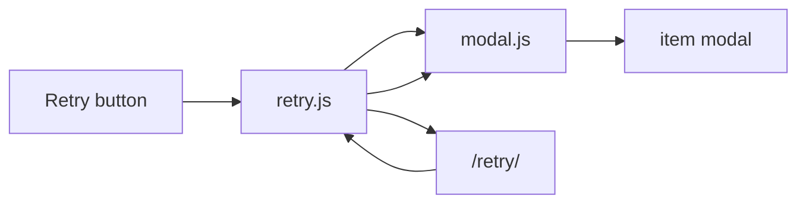

# Enrichment Pipeline Overview

The UI interacts with the backend through `retry.js` and delegates all modal
operations to `modal.js`. Item details are rendered via
`showItemModal(html)`.

```mermaid
flowchart LR
    RetryButton["Retry button"] --> RetryJS["retry.js"]
    RetryJS --> ModalJS["modal.js"]
    ModalJS --> ItemModal["item modal"]
    RetryJS --> Backend["/retry/<id>"]
    Backend --> RetryJS
    RetryJS --> ModalJS
```
